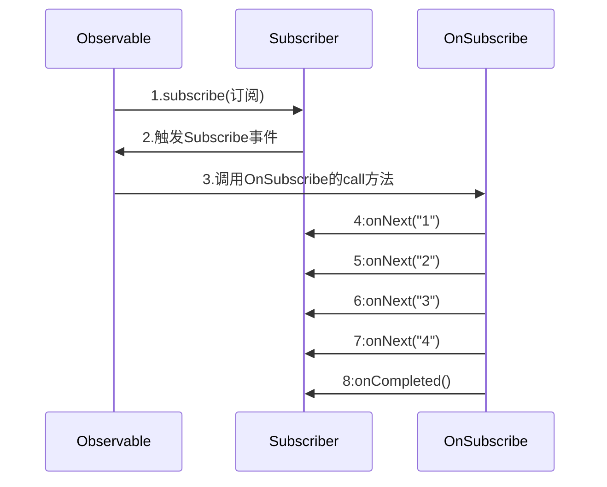

# RxJava学习笔记(一)

> 注意:这篇文章只是本人学习过程中的的笔记而已,如有错误实属正常,欢迎一起交流,本文涉及的RxJava的版本是1.x,还有一点是文中所指的Observer在代码中等价于Subscriber,Subscriber实现了Observer接口并且多了一个onStart的方法.

## 一、简介
- 什么是RxJava
	- 这个怎么说呢,用官方项目的一句话就是"a library for composing asynchronous and event-based programs using observable sequences for the Java VM",翻译过来就是,一个在 Java VM 上使用可观测的序列来组成异步的、基于事件的程序的库.是不是没看懂??没关系 我也不是很懂.
- RxJava有啥好处
	- RxJava主要是用在异步操作上面的,那么问题来了,那么多异步操作的库,RxJava有啥优点呢?其主要的优点是简洁,解决回调地狱可是好帮手呀.还支持背压(背压是啥,后面再讲)
- RxJava设计思想
	- RxJava 主要是基于观察者模式进行设计的,观察者模式涉及到观察者和被观察者这两个概念.什么是观察者模式呢?举个例子,你喜欢一个女孩,但是那个女孩已经有男朋友了,不过你还是不死心一如既往的关心她,直到那个女孩分手你就知道有机会了,要下手了.这个例子里面女孩是被观察者而你是观察者,女孩分手了,你收到了一个事件,然后就开始行动了.然而在程序里面是这样的,你订阅那个女孩或者注册一个监听器,这样在那个女孩没有分手的时候你也犯不着每天关心她,因为这样也没有意义.那么怎么才能知道那个女孩分手了,你好采取行动呢??这点不用担心,只要你订阅了那个女孩或者说是注册了监听器的,女孩分手的时候会主动通知你的,是不是感觉很棒??别傻了,现实生活中如果你被主动通知了,顶多你算是个备胎.  
	- 以上的例子如果感觉太抽象的话,可以这样来想,写过java的swing吗?写过java的awt吗??写过那就好理解多.在举个例子,在swing中,创建一个按钮,点击一个按钮弹出消息框.代码通常是这样的,先new Button(),然后再button上注册里一个onClickListener.这就是一个个观察者和被观察者.在用户点击这个button的时候会触发一个click事件,button会通知注册在它身上的所有监听器,包括刚才注册的OnClickListener.
- RxJava中的基本概念
	- Observable 被观察者
	- Observer 观察者
	- Subscribe 订阅
	- Event 事件,以下是默认事件.
		-  onNext 普通的事件回调
		-  onCompleted 当事件链完成时的触发
		-  onError 当事件链出现错误时的触发
		-  onStart 调用Subscribe方法的时候触发,这个是有默认实现的.只不过默认实现是什么也没做而已.

	一般的流程是,创建好被观察者(Observable)和观察者(Observer),两者通过订阅(Subscribe)联系到一起,当被观察者(Observable)有事件(Event)产生的时候会通知观察者(Observer)做相应的处理.

## 二、创建一个Observable
创建Observable可以通过Observable的静态API `public static <T> Observable<T> create(OnSubscribe<T> f)` 创建,create重载的api有3三个.先看这个API吧,剩下的3个重载API后面再说吧.这个API需要一个OnSubscribe对象作为参数,这个OnSubscribe对象是来干啥的呢??这个其实就是一个用来产生事件的监听器而已(如果这么理解的话),当Observer订阅了Observable就会调用OnSubscribe的call方法.下面贴出create方法, OnSubscribe,的完整代码,便于理解.

```java

		public static <T> Observable<T> create(OnSubscribe<T> f) {
		    return new Observable<T>(RxJavaHooks.onCreate(f));//这个可以先不管
		}
	    
	    
	    //可以看到OnSubscribe 是个集成Action1的接口而已,接下来看看Action1的代码
		public interface OnSubscribe<T> extends Action1<Subscriber<? super T>> {
			  // cover for generics insanity
		}
		//Action1 这个接口默认只有一个方法. 然而这个接口却是集成了Action这个接口.Action接口是个空接口,Action接口继承了Function接口,Function接口也是空接口,由于都是空接口就不贴代码出来了.
		public interface Action1<T> extends Action {
		    void call(T t);
		}
		
```

那么创建Observable的代码就好理解了,以下是创建Observable的代码.

```java
	//这样就创建了一个Observable
	Observable<String> observable = Observable.create(subscriber -> {
	            subscriber.onNext("1");
	            subscriber.onNext("2");
	            subscriber.onNext("3");
	            subscriber.onNext("4");
	            subscriber.onCompleted();
	        });
```
上面代码中的Subscriber是实现了观察者(Observer)接口.上面的代码解释为,当Observable被订阅的时候就触发OnSubscribe,在OnSubscribe中触发Subscriber的onNex方法t四次和onCompleted方法一次.  

## 三、创建一个Subscriber

emmmmm目前还没有Subscriber,所以要创建它.创建Subscriber也很简单,如下代码.

> Subscriber 等价于 Observer

```java
Subscriber<String> subscriber = new Subscriber<String>() {
        @Override
        public void onCompleted() {
            System.out.println("subscriber onCompleted");
        }
	
        @Override
        public void onError(Throwable e) {
            System.out.println("subscriber onError");
        }
	
        @Override
        public void onNext(String s) {
            System.out.println("subscriber out:" + s);
        }
	
    };
```
## 四、建立订阅关系
创建好Observable和Subscriber以后,要把二者建立订阅关系整个流程才算搞定.建立订阅关系代码如下

```java
 	observable.subscribe(subscriber);
```
一句代码,很简单对不对.问题是为啥是被观察者订阅观察者呢??其实这是方便链式api的书写(习惯就好).完整代码如下

```java
public class Demo {


    public static void main(String[] args) throws InterruptedException {


        Observable<String> observable = Observable.create(subscriber -> {
            subscriber.onNext("1");
            subscriber.onNext("2");
            subscriber.onNext("3");
            subscriber.onNext("4");
            subscriber.onCompleted();
        });


        Subscriber<String> subscriber = new Subscriber<String>() {
            @Override
            public void onCompleted() {
                System.out.println("subscriber onCompleted");
            }

            @Override
            public void onError(Throwable e) {
                System.out.println("subscriber onError");
            }

            @Override
            public void onNext(String s) {
                System.out.println("subscriber out:" + s);
            }
        };


        observable.subscribe(subscriber);


    }
}
```

运行结果如下:

```
subscriber out:1
subscriber out:2
subscriber out:3
subscriber out:4
subscriber onCompleted
```


## 五、流程关系



## 六、总结

只要把里面的观察者和被观察者这两者的概念掌握牢固,还是简单.不过看来看去好像没有啥实际的作用,emmmm目前看来是的.但后面操作符和线程调度可有意思多了.

