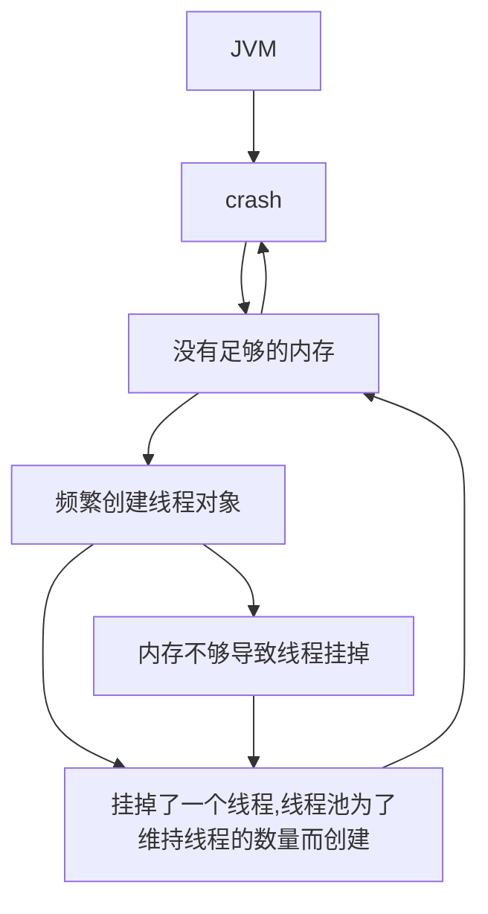
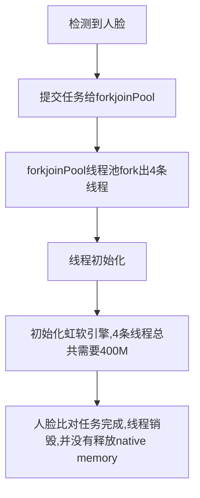

# 一、前言

使用jna和jni都不可避免内存泄露的问题,一般内存泄露分两种,一种本地库本身有内存泄露问题,另一种JVM 内存中 native memory 的内存泄漏.

本地库本身有泄露这种定位起来比较麻烦,毕竟你也没有他的源码不是.native memory 内存泄露这个还比较好定位,首先保护好案发现场,保存好程序运行日志,heap dump 下来,然后就可以慢慢的来调查来,一般都可以石锤. 

笔者这次出现问题,主要是因为换了个线程池导致的.为了加快虹软的对比速度,采用了多线程并发的方式进行对比,只要其中一个对比成功,其余任务全部取消.当时为了上线急忙忙的自己实现了,线程池采用的是`ThreadPoolExecutor`,并继承Thread对象,在该对象类引入虹软的人脸识别引擎,该方式是为了每个线程独享一个虹软引擎.

上线之后发现程序运行正常,没有什么大问题,只是识别的速度稍微有点慢,于是我想用forkjoin的方式来优化多线程识别,结果换了forkjoinPool 之后就GG了.

> Tip: 在java 8 中的parallelStream 是用的forkjoin common pool,但是也可以指定线程池的.例如:
>
> ```java
> //使用指定的pool而非commonPool
> ForkJoinPool forkJoinPool = new ForkJoinPool(2);
> forkJoinPool.submit(() ->
>     //parallel task here, for example
>     IntStream.range(1, 1_000_000).parallel().filter(PrimesPrint::isPrime).collect(toList())
> ).get();
> ```


# 二、案发现场

先看看虚拟机crash时的日志

```shell
#
# There is insufficient memory for the Java Runtime Environment to continue.
# Native memory allocation (malloc) failed to allocate 396336 bytes for Chunk::new
# Possible reasons:
#   The system is out of physical RAM or swap space
#   In 32 bit mode, the process size limit was hit
# Possible solutions:
#   Reduce memory load on the system
#   Increase physical memory or swap space
#   Check if swap backing store is full
#   Use 64 bit Java on a 64 bit OS
#   Decrease Java heap size (-Xmx/-Xms)
#   Decrease number of Java threads
#   Decrease Java thread stack sizes (-Xss)
#   Set larger code cache with -XX:ReservedCodeCacheSize=
# This output file may be truncated or incomplete.
#
#  Out of Memory Error (allocation.cpp:390), pid=13568, tid=0x0000000000002278
#
# JRE version: Java(TM) SE Runtime Environment (8.0_171-b11) (build 1.8.0_171-b11)
# Java VM: Java HotSpot(TM) 64-Bit Server VM (25.171-b11 mixed mode windows-amd64 compressed oops)
# Failed to write core dump. Minidumps are not enabled by default on client versions of Windows
#

---------------  T H R E A D  ---------------

Current thread (0x000000001afcc800):  JavaThread "C2 CompilerThread1" daemon [_thread_in_native, id=8824, stack(0x000000001b7e0000,0x000000001b8e0000)]

Stack: [0x000000001b7e0000,0x000000001b8e0000]
[error occurred during error reporting (printing stack bounds), id 0xc0000005]

Native frames: (J=compiled Java code, j=interpreted, Vv=VM code, C=native code)


Current CompileTask:
C2: 857396 14693       4       ch.qos.logback.classic.spi.StackTraceElementProxy::getSTEAsString (38 bytes)


---------------  P R O C E S S  ---------------

Java Threads: ( => current thread )
  0x0000000028049800 JavaThread "fork-join-face-115" daemon [_thread_blocked, id=4384, stack(0x00000003dcc90000,0x00000003dcd90000)]
#省略线程信息...
```

从crash日志上看,说是jvm申请396336字节大小的native memory 的时候内存不够然后crash掉了.log给出可能导致crash的原因:

- The system is out of physical RAM or swap space ,这条不是可能的,服务器的内存是8G,而程序crash掉的时候 是4G多的时候
- In 32 bit mode, the process size limit was hit,这条也不可能,因为服务器是64位的,jdk也是64位的.

从上面的日志信息并没有看出什么有用的信息,但有个问题很奇怪明明内存够为什么会crash,在看看程序的运行日志:

```java
2018-11-14 11:10:22 | ERROR | face-192.168.0.2-Thread | com.zzwtec.camera.fx.service.face.FaceService.lambda$init$1:129 | [face-192.168.0.2-Thread]  人脸检测任务出现异常!
java.lang.Error: Invalid memory access
	at com.sun.jna.Native.invokeInt(Native Method)
	at com.sun.jna.Function.invoke(Function.java:419)
	at com.sun.jna.Function.invoke(Function.java:354)
	at com.sun.jna.Library$Handler.invoke(Library.java:244)
	at com.sun.proxy.$Proxy150.AFT_FSDK_InitialFaceEngine(Unknown Source)
	at com.zzwtec.camera.fx.face.Tracking.<init>(Tracking.java:34)
	at com.zzwtec.camera.fx.face.FaceThread.<init>(FaceThread.java:17)
	at com.google.common.util.concurrent.ThreadFactoryBuilder$1.newThread(ThreadFactoryBuilder.java:163)
	at java.util.concurrent.ThreadPoolExecutor$Worker.<init>(Unknown Source)
	at java.util.concurrent.ThreadPoolExecutor.addWorker(Unknown Source)
	at java.util.concurrent.ThreadPoolExecutor.processWorkerExit(UnknownSource)
	at java.util.concurrent.ThreadPoolExecutor.runWorker(Unknown So
```

大量出现`java.lang.Error: Invalid memory access`的错误,但有个问题值得注意是我创建的是个线程池,按道理是不会频繁创建线程的,为啥会这么频繁的创建线程?而且创建线程的时候都是在虹软SDK 初始化引擎的时候挂掉了.

```java
private static final int FD_WORK_BUF_SIZE = 20 * 1024 * 1024;// 20 MB
private static final int nScale = 16; // 有效值范围[2,50]
private static final int MAX_FACE_NUM = 16; // 有效值范围[1,50]
private Pointer hFDEngine;
public Detection(){
        String APPID = null;
        String FD_SDKKEY = null;
        if(OSUtils.getCurrentOSType() == OSUtils.OSType.Windows){
            APPID = ArcFace.appid_Windows_x64;
            FD_SDKKEY = ArcFace.sdkkey_FD_Windows_x64;
        } else if(OSUtils.getCurrentOSType() == OSUtils.OSType.Linux){
            APPID = ArcFace.appid_Linux_x64;
            FD_SDKKEY = ArcFace.sdkkey_FD_Linux_x64;
        }
        Pointer pFDWorkMem = CLibrary.INSTANCE.malloc(FD_WORK_BUF_SIZE);
        PointerByReference phFDEngine = new PointerByReference();
        NativeLong ret = AFD_FSDKEngine.INSTANCE.AFD_FSDK_InitialFaceEngine(
                APPID,
                FD_SDKKEY,
                pFDWorkMem,
                FD_WORK_BUF_SIZE,
                phFDEngine,
                FSDK_OrientPriority.FSDK_OPF_0_HIGHER_EXT,
                nScale,
                MAX_FACE_NUM);
        if (ret.longValue() != 0) {
            CLibrary.INSTANCE.free(pFDWorkMem);
            System.err.println(String.format("AFD_FSDK_InitialFaceEngine ret 0x%x %s", ret.longValue(), Error.getErrorMsg(ret.longValue())));
        }
        hFDEngine = phFDEngine.getValue();
    }
```

可以通过以上代码知道,初始化一个Detection对象至少需要20M内存,而且笔者把三个引擎对象全部放在一个线程对象里面,三个引擎全部初始化完毕至少需要100M的内存.如果线程频繁的创建的确会导致内存泄露的问题,因为笔者没有考虑到线程被频繁创建的情况,所以没有写释放内存的方法和复写finalize方法.


# 三、原因分析

通过crash日志和运行日志可以看出:



emmmm,看起来还是怪怪的,这TM不是一个循环嘛!思绪已经陷入死胡同了,好不容易找到线索又给断了.


# 四、还原案发现场

既然线索断了,就看能不能还原案发现场了,就是本地复现一次.但这种复现是要有点技巧的,并不是把整个程序跑跑之类,一定要找关键代码,来测试.从日志可以看出是jna这块儿出的问题,那么在笔者这个项目中用到了jna的是人脸检测和人脸对比了.

于是笔者分别把这两块儿功能的代码在本地代码跑了10W次,在人脸检测这块儿并没有发现内存泄露的情况,但在人脸比对的时候内存泄露显著,并且还复现了jvm crash的这种情况.

那么就是有点意思了,说明出现问题的就是人脸对比了.人脸对比这块儿,是用的forkjoinPool 的线程池,之前没用这个的时候就没问题,难道forkjoinPool这个线程池和普通的threadPoolExecutor不一样?

于是怀着揭开真相的心情,启动了jvisualvm,通过jvisualvm观察可以发现,forkjoinPool线程池接受一次任务会启用物理机最大核心数的线程数量,也就是说在2核4线程的机器上,forkjoinPool会开启4条线程来处理任务.

但这4条线程并不是复用,而是一次性的.通过观察可以看出当这4条线程在一定时间内没有任务执行的时候会被销毁.毕竟工作窃取算法没工作窃取了嘛,窃笑.

# 五、石锤

通过案发现场的还原,得出的结论是:



这个过程,会在程序运行的时候循环很多次.

以上只是我的猜想,有个疑惑的是,线程为什么不复用,需要反复创建怎么多次?

于是看了一下源码,普通的threadPoolExecutor里面是有个任务队列的,创建出的线程会一直pll这个队列,如果队列中就任务,那么该线程就会执行这个任务,如果队列没有任务那么该线程就会wait,直到有任务为止.

与threadPoolExecutor不同的是forkjoinPool采用分而治之的方式来并行处理任务.当任务添加到forkjoinPool时,会把任务不断的分割直到任务足够的小才会开始执行.如果这里的处理的方式和threadPoolExecutor一样,处理完任务就wait,就无法分而治之了.

通过以上的分析,笔者把创建线程初始化逻辑改了一下,把虹软的引擎缓存起来,创建线程的时候每个线程分配一个.这样不管创建多少个线程,整个程序只会有缓存起来的那几个引擎,不会随着线程的创建而创建.笔者把修改好的代码进行10W次循环测试,果然没有复现内存泄露的问题,后面又进行了12小时的循环测试,也没发现问题.线程池的问题,可谓是石锤了.


# 六、结论

遇到这种jna的问题,一定不要慌,要通过多方面的分析来断案,不要怕crash的日志.基础还是很重要呀,原来forkjoinPool不重复使用线程,这点之前都没注意过.认真学习.🤣🤣🤣🤣🤣🤣🤣
